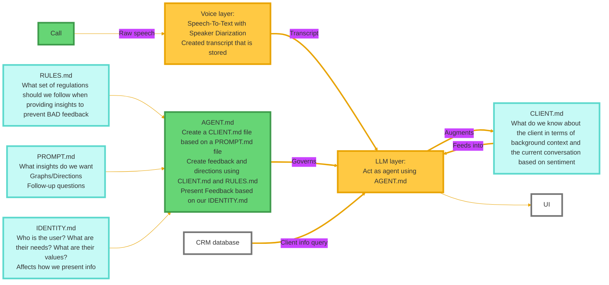

# EchoLens → AI Sales Call Advisor (Mastra.ai + Smallest.ai + Clientzone) Refactor Plan

This document updates the previous refactor plan to incorporate Mastra.ai, Smallest.ai, and Clientzone (Mantra.ai) based on `mastra_smallest_sales_agent.md`. It maps the current EchoLens codebase to the target architecture, and provides an end‑to‑end development plan with schema migration guidance.

**Reference Diagram (from request)**

**Target Architecture Overview (Mastra.ai + Smallest.ai)**

The updated system follows the production architecture described in `mastra_smallest_sales_agent.md`.

1. Voice layer is handled by Smallest.ai ATOMS for STT and WAVES/Lightning for ultra‑low‑latency TTS.
2. Agent layer is handled by Mastra.ai, with a Sales Conversation Director orchestrating sub‑agents.
3. Workflows in Mastra handle discovery, demo, objections, and closing.
4. Tools integrate CRM (Salesforce), calendar, knowledge base (Pinecone), analytics, and pricing.
5. Memory and context are thread‑based inside Mastra, with semantic recall for past interactions.
6. Data layer includes PostgreSQL, Redis, and Pinecone.
7. UI shows live call transcript plus coaching, objections, next steps, and compliance warnings.

**Note on Clientzone (Mantra.ai)**

The file `mastra_smallest_sales_agent.md` does not explicitly mention Clientzone. This plan includes Clientzone as a client‑facing portal integration point in the UI and data layer, but the implementation details are left as a plug‑in interface to be filled with Clientzone APIs and auth flows.

**End‑to‑End Runtime Architecture (Detailed)**

1. Call Ingestion
   A call source (phone/WebRTC/SIP trunk) sends raw audio into the system. EchoLens’s current mic‑based flow becomes a call‑provider audio stream. This is the entry point for the voice layer.

2. Smallest.ai Voice Layer
   Smallest.ai ATOMS creates a real‑time transcription session per call and streams partial and final transcripts. Smallest.ai WAVES provides 100ms TTS for agent responses. The voice layer supports barge‑in/interrupts and low‑latency end‑of‑speech detection.

3. Transcript Storage and Speaker Diarization
   Every final transcript segment is persisted with speaker labels and timestamps. The transcript stream is also used for real‑time coaching outputs.

4. Mastra.ai Agent Layer
   The Sales Conversation Director agent orchestrates sub‑agents and workflows. It routes questions to product experts, objections to objection handling, and buying signals to closing. Mastra memory maintains a thread per call and supports semantic recall.

5. Tools and Data Sources
   Mastra tools pull CRM data from Salesforce or other CRM, fetch knowledge from Pinecone, schedule follow‑ups via Calendar tool, and update CRM with extracted insights. Redis handles session state and PostgreSQL stores structured CRM data and call logs.

6. Output Routing and UI
   Mastra outputs are streamed to the UI via WebSocket. The UI shows coaching insights, objections, follow‑up questions, and next steps. Clientzone is integrated here to expose call summaries and follow‑ups to external stakeholders.

7. Observability and Analytics
   Mastra telemetry provides tracing across agent calls, workflows, tools, and memory operations. Custom analytics track call duration, talk ratio, objections, and conversion outcomes.

**How EchoLens Maps to the Target Architecture**

1. Call Ingestion and Voice Layer
   Current EchoLens uses `use-deepgram.ts` in the browser to stream mic audio. For sales calls, this must be replaced with the Smallest.ai voice pipeline on the server side. The existing transcript buffer and live transcript UI can be reused.

2. Orchestration
   The EchoLens orchestrator in `src/services/orchestrator/orchestrator.service.ts` becomes the integration layer between transcripts and Mastra agents. It will shift from in‑house intent classification to Mastra’s agent and workflow engine.

3. Agents
   EchoLens agents map to Mastra sub‑agents. The existing chart/reference/summary agents are replaced by Product Expert, Objection Handler, Qualifier, Closing, and Negotiator agents as described in `mastra_smallest_sales_agent.md`.

4. UI
   The current UI cards become coaching cards. `MainLayout` can be repurposed to show live transcript, detected objections, buying signals, and recommended next steps.

5. Data Layer
   EchoLens currently uses mock context JSON. This is replaced by CRM and knowledge base integrations and persistent storage (PostgreSQL + Redis + Pinecone).

**Key Modules to Add and Refactor**

1. Smallest.ai Voice Pipeline
   Create `src/voice/smallest-voice-pipeline.ts` using the exact structure described in `mastra_smallest_sales_agent.md`. This will replace Deepgram in production while maintaining the streaming transcript interface.

2. Mastra Agents and Workflows
   Add `src/mastra/agents` and `src/mastra/workflows` with Sales Director, Product Expert, Objection Handler, Qualifier, Closing, and Negotiator agents. Implement discovery, demo, objection, and closing workflows.

3. Mastra Tools
   Add `src/mastra/tools` with CRM updates, knowledge base search, calendar scheduling, analytics updates, and pricing tools. Use the Salesforce tool and Calendar tool patterns from the reference document.

4. Memory and Context
   Integrate Mastra memory threads for each call session. Use semantic search for recalling prior objections or related customer context. Persist call artifacts into PostgreSQL for cross‑session insights.

5. Clientzone Integration
   Add a `src/integrations/clientzone` adapter. This should receive call summaries, action items, and follow‑ups for downstream portals. Detailed API behavior should be added once Clientzone specs are available.

**New Directory Structure (Proposed)**

1. `src/voice/smallest-voice-pipeline.ts`
2. `src/mastra/index.ts`
3. `src/mastra/agents/*`
4. `src/mastra/workflows/*`
5. `src/mastra/tools/*`
6. `src/integrations/clientzone/*`
7. `src/services/transcript/*`
8. `src/services/analytics/*`
9. `src/services/policy/*`

**Refactor Plan (Phased)**

### Phase 1: Voice Layer Replacement
1. Add Smallest.ai voice pipeline and session management.
2. Replace Deepgram‑based client hook with server‑side audio ingestion.
3. Maintain WebSocket transcript stream to UI.

### Phase 2: Mastra Agent Integration
1. Initialize Mastra in `src/mastra/index.ts` with telemetry enabled.
2. Add Sales Director and sub‑agents per the reference file.
3. Replace EchoLens intent classification with Mastra agent routing.

### Phase 3: Tools and Workflows
1. Add Mastra workflows for discovery, demo, objection handling, and closing.
2. Add CRM tools and knowledge base tools (Pinecone).
3. Implement CRM update tool for Salesforce or equivalent.

### Phase 4: Memory, Context, and CRM
1. Store call transcripts in PostgreSQL.
2. Connect Mastra thread memory to persistent storage.
3. Implement CRM lookups for client context and populate CLIENT.md.

### Phase 5: UI & Clientzone
1. Replace chart/reference panels with coaching and sales insights.
2. Add UI for objections, buying signals, and next‑best actions.
3. Integrate Clientzone export for summaries and action items.

### Phase 6: Production Hardening
1. Add observability, structured logging, and performance dashboards.
2. Implement evals for discovery and objection handling quality.
3. Validate latency budget and optimize for sub‑1.5s response time.

**End‑to‑End Flow (Concrete Execution)**

1. Call starts. The call provider connects to the server.
2. Smallest.ai session is created using `startConversation` with configured voice and STT parameters.
3. Audio streams into Smallest.ai. Partial and final transcripts are emitted.
4. Final transcripts are persisted and sent to Mastra Sales Director agent.
5. Mastra routes the input to sub‑agents and workflows based on detected signals.
6. Tools retrieve CRM context and knowledge base answers; results are merged into responses.
7. Mastra outputs a response. The response is synthesized with Smallest.ai TTS.
8. Audio is streamed back to the caller. The UI receives transcript and coaching metadata over WebSocket.
9. CRM is updated with extracted insights and next steps. Clientzone receives an exported summary.

**Latency Budget (Target)**

The target is sub‑1.5s end‑to‑end latency, aligned with the reference doc.

1. VAD and end‑of‑speech detection: ~100ms
2. Smallest.ai STT (Electron model): ~150ms
3. Mastra reasoning: ~400ms
4. Response generation: ~500ms
5. Smallest.ai TTS (WAVES/Lightning): ~100ms
6. Network transmission and playback: ~100ms

**Deployment and Scaling (from reference)**

1. Use Docker or Kubernetes for production deployments.
2. Include Redis for session state, PostgreSQL for structured CRM data, and Pinecone for vector search.
3. Add Nginx as a reverse proxy.

**Schema Migration Plan**

Goal: introduce speaker diarization, call session metadata, and new agent output types without breaking the current UI or tests.

1. Versioned schemas
   Add `schemaVersion` to transcript segments, agent payloads, and session metadata.

2. Dual‑write strategy
   Emit both legacy EchoLens payloads and new sales‑advisor payloads during transition.

3. Compatibility adapters
   Update `use-echolens-ws.ts` and `echolens-store.ts` to accept both versions and normalize into UI models.

4. Data backfill
   Write a migration script to add default speaker fields and call IDs to existing transcript records.

5. Test migration
   Update fixtures in `__tests__/fixtures/gemini-responses.ts` and add Mastra‑focused fixtures for new agents.

6. Deprecation cleanup
   Remove legacy payloads after the new UI is fully deployed and validated in production.

**Files to Update in Current Codebase**

1. `src/hooks/use-deepgram.ts`
   Replace with server‑side audio ingestion and Smallest.ai session creation.

2. `src/lib/transcript-buffer.ts`
   Extend to support speaker diarization, timestamps, and call IDs.

3. `src/types/transcript.ts`
   Add speaker fields and schema versioning.

4. `src/services/orchestrator/orchestrator.service.ts`
   Replace with Mastra agent integration and workflow routing.

5. `src/components/layout/main-layout.tsx`
   Replace chart and reference panels with coaching insights and objection handling UI.

6. `src/store/echolens-store.ts`
   Add new state slices for objections, buying signals, next steps, and compliance warnings.

**Deliverables Checklist**

1. Smallest.ai voice pipeline implemented and tested.
2. Mastra Sales Director agent + sub‑agents implemented.
3. Mastra workflows for discovery, objections, and closing.
4. CRM and calendar tools integrated.
5. Knowledge base integration with Pinecone.
6. UI updated to sales‑advisor coaching experience.
7. Clientzone export API adapter added.
8. Observability, evals, and latency benchmarks in place.

**Open Items Requiring Clientzone Specifications**

1. Authentication and access scopes for Clientzone.
2. Summary and action item payload schema.
3. Delivery method (push or pull) for Clientzone updates.
4. Data retention and compliance rules for Clientzone artifacts.

This refactor plan aligns EchoLens with the full production architecture described in `mastra_smallest_sales_agent.md`, while retaining the real‑time UI and WebSocket backbone from the existing codebase.
